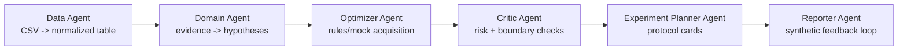

# BOagent Agent Team Architecture

## 1. Reference Pattern

This project borrows the lightweight vertical-agent pattern from the Claw Code / AutoPolyAgent architecture:

- Claw Code pattern: runtime loop, session/provenance thinking, permission/guardrail boundary.
- AutoPolyAgent pattern: domain-specific staged pipeline rather than a general-purpose agent harness.
- BOagent adaptation: a Streamlit demo uses deterministic Python stages that behave like an agent team, without adding a real multi-agent runtime in P0.

P0 intentionally keeps the runtime simple. The app exposes the agent team as a product narrative and testable pipeline, not as live LLM agents.

## 2. Team Roles

| Role | Responsibility | P0 Implementation |
|---|---|---|
| Data Agent | Load CSV, normalize schema, summarize data health | `load_experiment_data`, `build_data_summary` |
| Domain Agent | Convert passivator evidence into cautious hypotheses | Recommendation hypothesis fields |
| Optimizer Agent | Generate next-batch candidates with rules/mock scoring | `generate_recommendations` |
| Critic Agent | Flag data-boundary and scientific-claim risks | `risk_level`, `data_boundary`, `validation_required` |
| Experiment Planner Agent | Turn candidates into executable experiment cards | Recommendation `steps`, `process`, `observations` |
| Reporter Agent | Package leader-facing workflow and simulated feedback | `simulate_feedback`, Streamlit tabs |

## 3. Pipeline Flow



## 4. Guardrails

- Never claim real BO performance in P0.
- Never treat mixed literature records as a controlled causal benchmark.
- PipDI must remain `demo-only exploration` until real samples are added.
- All predicted or synthetic values must be labeled as demo/simulated.
- Every recommendation must include evidence boundary, risks, and validation requirement.

## 5. Implementation Map

```text
app.py
  Streamlit UI and leader-demo story

pvk_demo.py
  Deterministic agent-team pipeline
  Dataclasses for stages, data summary, recommendations

tests/test_pvk_demo.py
  Behavior tests for data loading, summary, recommendations, feedback, and team roles

demo_optimization_table.csv
  Current evidence table used by the demo
```

## 6. Future Upgrade Path

If the demo is approved, the deterministic stages can be upgraded one by one:

1. Replace Data Agent with real extraction/curation workflow.
2. Replace Optimizer Agent with a real feature table and BO implementation.
3. Add provenance artifacts for every recommendation.
4. Add a real agent runtime only after the deterministic pipeline is trusted.
5. Add audit logging and export disclaimers before any external sharing.
