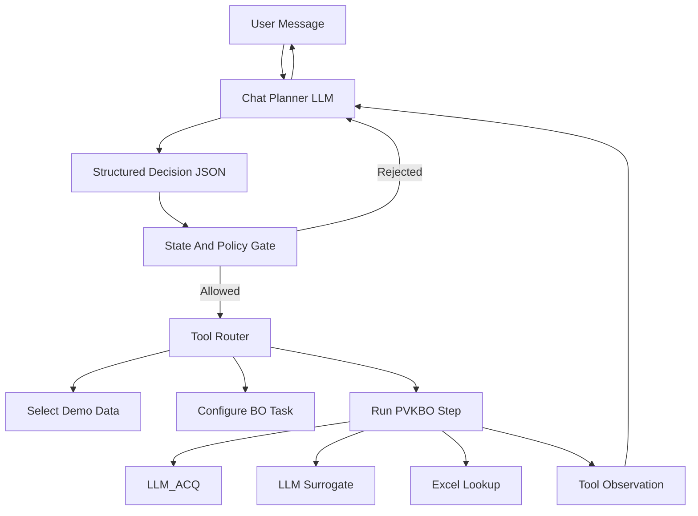

# BO Agent Hybrid Gated Design

## Goal

Redesign the BOagent chat flow so normal conversation is handled by a real LLM, while Bayesian optimization is only executed after explicit user confirmation and backend policy checks.

The first version supports built-in PVK demo data only. User upload is not implemented yet. The agent must clearly say when demo data is being used and must never imply that user data exists before upload support is added.

## Chosen Architecture

Use a Hybrid Gated ReAct Agent:

- Chat Planner LLM understands the user, asks follow-up questions, and emits structured decisions.
- State Gate validates whether the proposed action is allowed.
- Tool Router maps allowed actions to backend tools.
- PVKBO Runtime runs the real optimization workflow.
- Result Narrator uses tool observations to explain results without inventing unsupported claims.



## Why Not Pure ReAct

Pure ReAct would let the LLM decide when to call tools directly. That is too risky for scientific optimization because the model could run BO before data, objective, or demo-data consent is confirmed.

This design keeps the ReAct loop, but gates every action:

```text
Reason: Chat Planner LLM proposes the next action.
Act: Backend gate decides whether to execute it.
Observe: Tool output is returned as structured observation.
Answer: LLM summarizes the observation for the user.
```

## Conversation State Machine

First version states:

```text
idle
awaiting_data_choice
awaiting_demo_confirm
awaiting_goal_confirm
ready_to_run
running_bo
reporting
```

State rules:

- `idle`: user can chat; no BO session is created.
- `awaiting_data_choice`: ask whether to use built-in PVK demo data or wait for future upload support.
- `awaiting_demo_confirm`: require explicit acknowledgement that demo data is built-in reference data, not user-uploaded data.
- `awaiting_goal_confirm`: confirm default demo task: `band_alignment`, maximize `eta/PCE`, use PVK-LLM workbook lookup.
- `ready_to_run`: show a run button and accept explicit “start/run optimization” messages.
- `running_bo`: backend runs PVKBO through the tool router.
- `reporting`: LLM explains real artifacts and next-step choices.

## Structured Decision Contract

The Chat Planner LLM must return valid JSON:

```json
{
  "intent": "greeting | ask_capability | select_demo_data | confirm_demo_data | confirm_goal | request_run | explain_result | other",
  "next_state": "idle | awaiting_data_choice | awaiting_demo_confirm | awaiting_goal_confirm | ready_to_run | running_bo | reporting",
  "action": {
    "type": "none | select_demo_data | confirm_demo_data | confirm_goal | create_bo_session | run_bo_step | explain_result",
    "args": {}
  },
  "assistant_message": "user-facing message",
  "ui_hints": ["show_demo_button", "show_upload_disabled", "show_run_button"]
}
```

Backend behavior:

- Accept only known states and action types.
- Reject any `run_bo_step` action unless all policy flags are true.
- If the LLM returns invalid JSON, fall back to a safe LLM retry or a non-BO clarification message.
- Never create a PVKBO session from a casual greeting.

## Tool Calls

Public tool actions for the Chat Planner:

```text
select_demo_data
confirm_demo_data
confirm_goal
create_bo_session
run_bo_step
get_bo_artifacts
explain_result
```

Internal PVKBO trace displayed to users:

```text
LLM_ACQ.get_candidate_points
LLM_SURROGATE.select_query_point
black_box.evaluate_candidate
PVKBO.update_observations
```

The Chat Planner should not directly call internal PVKBO trace steps. It requests `run_bo_step`; the backend executes the internal workflow.

## Policy Gate

Required flags before BO can run:

```text
data_source == "demo_pvk"
data_source_confirmed == true
demo_disclaimer_confirmed == true
goal_confirmed == true
user_confirmed_run == true
```

If any flag is missing, the backend rejects the action and asks the Chat Planner to produce a clarification message.

## Prompt Requirements

The system prompt should require:

```text
You are a PVK Bayesian Optimization Agent.
You help the user prepare and run a BO task through conversation.
Every turn must produce structured JSON with assistant_message, next_state, and action.
Do not run BO unless backend state says it is allowed.
If the user has not uploaded data, never imply user data exists.
If demo data is used, explicitly call it built-in demo/reference data.
Workbook lookup is reference evaluation, not wet-lab validation.
Ask for missing prerequisites before proposing BO execution.
Keep replies concise and action-oriented.
```

The prompt should include current backend state on every turn:

```json
{
  "state": "awaiting_demo_confirm",
  "data_source": "demo_pvk",
  "data_source_confirmed": true,
  "demo_disclaimer_confirmed": false,
  "goal_confirmed": false,
  "user_confirmed_run": false,
  "allowed_actions": ["confirm_demo_data", "none"],
  "forbidden_actions": ["create_bo_session", "run_bo_step"]
}
```

## Frontend Behavior

First version UI changes:

- Empty input should not default to “run real PVKBO”.
- Initial assistant message should introduce capabilities and ask for data choice.
- Show buttons or chips:
  - “Use built-in PVK demo data”
  - “Upload my data (coming soon)”
  - “Confirm demo data”
  - “Start first BO step”
- Disable “run BO” until `ready_to_run`.
- Artifact cards should remain empty until a BO session exists.

## API Changes

Add or adapt backend chat flow:

- Store per-chat agent state separately from PVKBO session state.
- Chat endpoint calls the Chat Planner LLM first.
- Backend validates the structured action.
- Backend only creates PVKBO session after demo data and goal are confirmed.
- Backend only runs PVKBO after explicit user run confirmation.

Existing PVKBO runtime can remain mostly unchanged.

## Testing

Required tests:

- “你好” calls Chat Planner LLM and does not create PVKBO session.
- Selecting demo data moves to `awaiting_demo_confirm` and does not run BO.
- Confirming demo data moves to `awaiting_goal_confirm`.
- Confirming goal moves to `ready_to_run`.
- Running BO from `ready_to_run` creates session and runs one PVKBO step.
- Attempting `run_bo_step` before confirmation is rejected.
- UI E2E: greeting → select demo → confirm demo → confirm goal → run BO → tool trace appears.

## Open Scope

Not included in first version:

- Real user file upload.
- Automatic schema inference for arbitrary CSV/XLSX.
- Multi-objective BO.
- Persistent sessions across server restarts.
- Cost budgeting UI.

These can be added after the conversation and gate model is correct.
