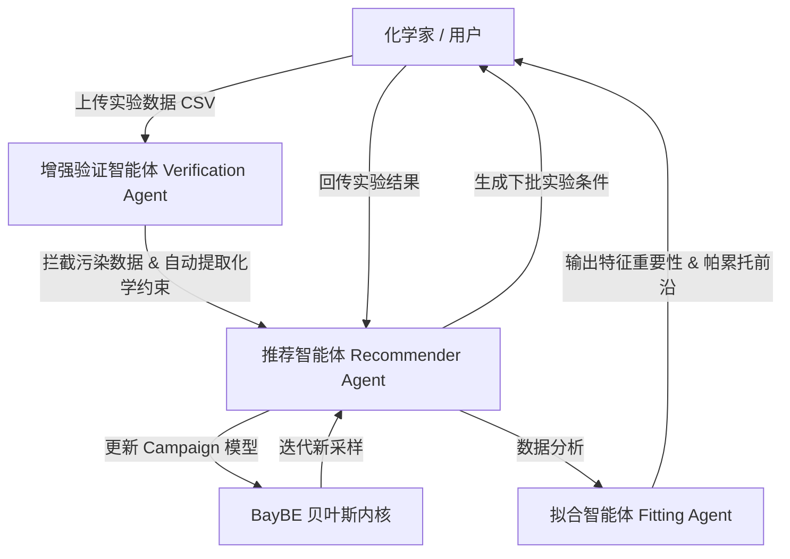

# ChemBoMAS / BoMAS: 基于 Google ADK 与 BayBE 的化学多智能体贝叶斯优化系统

> **论文引用**: [arxiv:2509.08736](https://arxiv.org/abs/2509.08736)  
> **项目路径**: `references/04-chemistry-materials-sdl/ChemBOMAS/`  
> **PDF 论文原件**: `references/04-chemistry-materials-sdl/ChemBOMAS/ChemBOMAS_paper.pdf`  
> **核心技术栈**: Python 3.12, Google Agent Development Kit (ADK), BayBE 贝叶斯框架, RDKit

---

## 1. 核心定位与创新点

**ChemBoMAS** (Chemical Bayesian Optimization Multi-Agent System) 是一个结合 **Google ADK 多智能体架构** 与 **BayBE 贝叶斯优化框架** 的智能化学实验闭环系统。

### 为什么需要多智能体 (Multi-Agent) 驱动贝叶斯优化？

| 维度 | 传统 BO 库 (如 BoTorch / Ax / BayBE) | ChemBoMAS (AI Agent 驱动) |
| :--- | :--- | :--- |
| **交互门槛** | 需要使用者具备较强 Python 编程与统计学背景 | **自然语言对话**，零代码门槛 |
| **边界与约束** | 参数边界和化学约束必须由用户代码硬编码 | **Agent 结合内置化学知识库与 RDKit 自动建议** |
| **采集策略** | 需人工经验选择 (如固定 qEI 或 qUCB) | **Agent 随优化轮次自适应切换**（探索 vs 利用） |
| **数据门控** | 无数据校验，脏数据会导致模型直接崩溃 | **验证智能体自动拦截**表头污染、非法 SMILES 与目标异常 |
| **多目标优化** | 需复杂的数学标量化函数设置 | **自动处理单目标、多目标及帕累托前沿 (Pareto)** |

---

## 2. 四大专业智能体协同架构 (Multi-Agent Architecture)

ChemBoMAS 将化学实验优化解构为 4 个协同工作的 Agent：

1. **主协调智能体 (Orchestrator Agent / `agent_zyf`)**：
   - 全局会话调度与意图理解，负责与用户进行自然语言交互，协调子 Agent 工作。
2. **增强验证智能体 (Enhanced Verification Agent)**：
   - **质量门控**：自动检查 CSV 表头污染、非数字字符及目标列合法性。
   - **化学分子校验**：集成 RDKit 工具库，自动校验 SMILES 分子结构有效性。
   - **约束自动生成**：自动识别配方比例列生成“和为 1”约束，为温度/压力等施加安全上限。
3. **统一推荐智能体 (Recommender Agent)**：
   - 驱动 BayBE 优化内核。根据当前优化进度，自适应在**探索型 (qUCB)** 与 **利用型 (qEI)** 之间切换采集函数，推荐下一批实验条件。
4. **拟合与分析智能体 (Fitting Agent)**：
   - 拟合代理模型，自动生成收敛轨迹图、特征重要性分析及多目标**帕累托前沿 (Pareto Frontier)** 报告。

---

## 3. 应用场景与数据规范

### 3.1 适用场景
- **环氧固化反应**、**高分子聚合反应**、**催化合成**、**材料配方**及**工艺参数优化**。

### 3.2 CSV 数据输入规范
- **目标列**: 必须以 `Target_` 开头（如 `Target_yield`）。
- **SMILES 分子列**: 列名包含 `SMILE`（大小写不敏感），自动触发分子描述符编码。
- **纯数值列**: 参数列禁止夹带单位或说明文本。

---

## 4. 与 BOagent (`bo-core`) 的联动与启发

| 特性 | ChemBoMAS (arXiv 2025) | BOagent (`bo-core`) |
| :--- | :--- | :--- |
| **多 Agent 调度** | 基于 Google ADK (Agent Development Kit) | 基于自研轻量级 Agent 管道 |
| **分子结构处理** | 基于 RDKit / SMILES 描述符 | 基于离散分类/One-Hot编码 |
| **知识注入** | 智能参数边界与化学安全约束顾问 | 豆包向量记忆库 (`VectorMemory`) + CBO/VBO 物理公式 |
